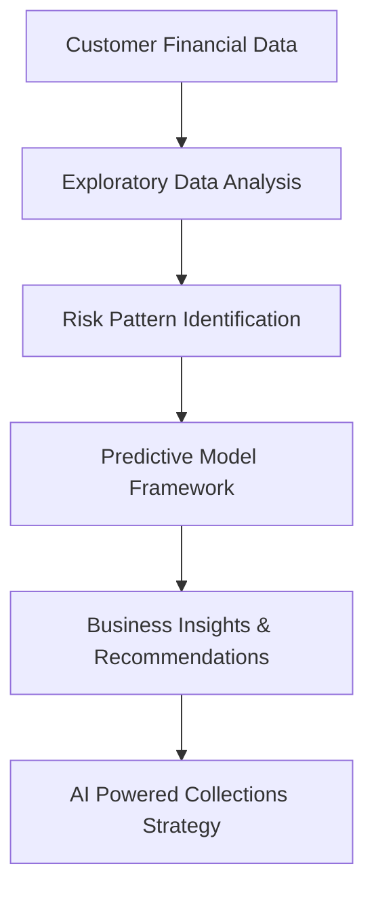
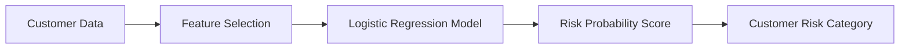
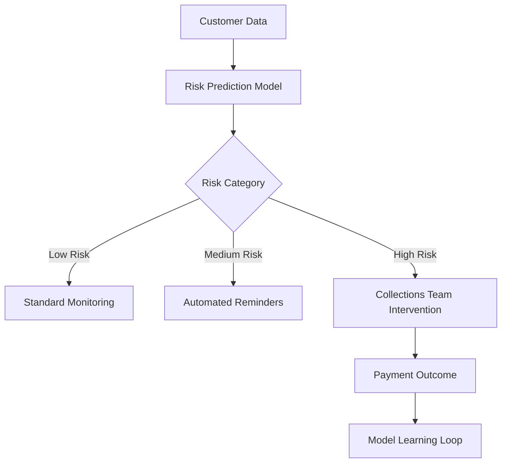

# GenAI Powered Data Analytics – Credit Risk & Delinquency Prediction

## Project Overview
This repository contains my work from the **Tata Group GenAI Powered Data Analytics Job Simulation (Forage)**.

The goal of this project was to analyze customer financial data and design a **predictive analytics framework** to identify customers who are at risk of becoming delinquent. Based on these insights, an **AI-powered collections system** was proposed to help financial institutions intervene earlier and improve collections strategy.

This project simulates the work of a **Data Analyst / AI Consultant**, focusing on translating data insights into business decisions.

---

# Business Problem

Financial institutions must identify customers who are likely to miss payments before delinquency occurs. Late detection leads to:

- Increased financial losses
- Higher operational collection costs
- Poor customer experience

The objective of this project is to use **data analytics and AI concepts** to:

- Identify risk indicators for delinquency
- Design a predictive model framework
- Recommend business interventions
- Propose an AI-powered collections system

---

# Dataset Overview

The dataset contains financial and behavioral attributes of customers.

| Feature | Description |
|------|------|
| Age | Customer age |
| Income | Annual income |
| Credit_Score | Customer credit rating |
| Credit_Utilization | Percentage of credit used |
| Missed_Payments | Number of missed payments |
| Loan_Balance | Outstanding loan amount |
| Debt_to_Income_Ratio | Ratio of debt to income |
| Account_Tenure | Years as customer |
| Delinquent_Account | Target variable (0 = No, 1 = Yes) |

**Target Variable:**  
`Delinquent_Account` indicates whether the customer has become delinquent.

---

# Project Workflow

---

# Task 1 – Exploratory Data Analysis (EDA)

EDA was performed to understand patterns and relationships between financial variables and delinquency risk.

## Key Analysis
- Distribution of financial variables
- Correlation between features
- Customer segmentation based on delinquency

## Example Analysis Steps
1. Load Dataset  
2. Check Data Types  
3. Handle Missing Data  
4. Compute Correlation Matrix  
5. Identify Risk Indicators  

## Key Insights

Top risk indicators discovered:

- **High Credit Utilization**
- **High Debt-to-Income Ratio**
- **Frequent Missed Payments**

These variables strongly influence delinquency probability.

---

# Task 2 – Predictive Model Framework

A conceptual predictive model was designed to identify high-risk customers.

## Model Options Considered

| Model | Advantages | Limitations |
|------|------------|------------|
| Logistic Regression | Interpretable, widely used in finance | Limited complexity |
| Decision Trees | Easy to explain decisions | Can overfit |
| Random Forest | Higher accuracy | Less interpretable |

## Selected Model

**Logistic Regression**

### Reasons
- Highly interpretable  
- Suitable for binary classification  
- Preferred in regulated financial environments  

---

# Predictive Model Logic

## Input Features Used

Top predictors:

- Credit Utilization
- Missed Payments
- Debt to Income Ratio
- Credit Score
- Loan Balance

## Output

The model produces a **risk probability score** indicating the likelihood that a customer may become delinquent.

---

# Task 3 – Business Recommendation

Based on predictive insights, a business recommendation framework was proposed.

## Top 3 Risk Factors

1. High credit utilization  
2. High debt-to-income ratio  
3. Frequent missed payments  

## Business Recommendation (SMART Goal)

Implement **early payment reminder programs** for customers whose credit utilization exceeds **50%**, reducing delinquency rates by **10% within 6 months**.

## Expected Impact

- Reduced financial losses
- Improved customer engagement
- Proactive risk management

---

# Task 4 – AI Powered Collections System

A conceptual **AI-powered collections system** was designed to automate early intervention.

## System Workflow

---

# Role of Agentic AI

| Autonomous AI | Human Oversight |
|---------------|----------------|
| Risk scoring of customers | Review high-risk accounts |
| Automated payment reminders | Approve collection actions |
| Monitoring repayment behavior | Handle exceptional cases |
| Updating risk categories | Ensure fairness and compliance |

This hybrid system combines **automation efficiency** with **human decision-making**.

---

# Responsible AI Principles

Because financial AI systems impact customers, responsible AI practices are critical.

### Key Safeguards

**Fairness Monitoring**  
Ensuring the model does not discriminate against certain groups.

**Explainable AI**  
Providing clear explanations for model predictions.

**Human-in-the-Loop**  
Human review for high-risk decisions.

**Regulatory Compliance**  
Adhering to financial regulations and audit requirements.

---

# Expected Business Impact

## Business KPIs

- Reduced delinquency rates
- Lower collection costs
- Faster risk detection
- Improved portfolio performance

## Customer Benefits

- Earlier financial assistance
- Transparent decision-making
- Improved customer experience
- Fair treatment across customer groups

---

# Skills Demonstrated

- Data Analysis
- Financial Risk Analytics
- Predictive Modeling Concepts
- Business Intelligence
- Responsible AI Design
- Data Storytelling

---

# Author

**Om Hole**  
Aspiring Data Analyst | AI & Data Analytics Enthusiast
