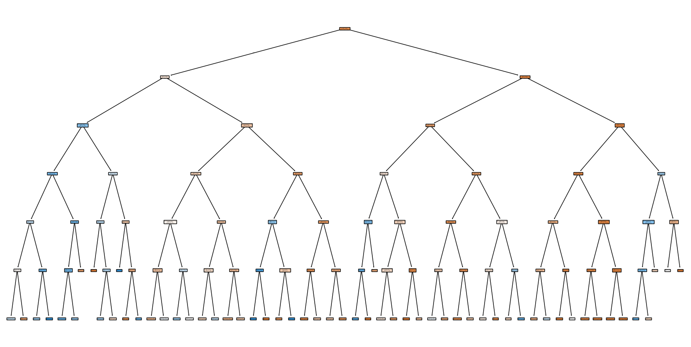

🌳 Task 03 – Decision Tree Classifier

Prodigy InfoTech Data Science Internship

🚀 Objective

The objective of this task is to build a Decision Tree Classifier to predict whether a customer will subscribe to a term deposit based on demographic and behavioral data.

📁 Dataset
Dataset: Bank Marketing Dataset (UCI Repository)
File used: bank-additional-full.csv
Total records: 41,188
Target variable: y (yes/no)

🧹 Data Preprocessing

The dataset did not contain null values, but included "unknown" values which were treated as missing.

Steps performed:

Replaced "unknown" with missing values
Filled categorical missing values using mode
Dropped the duration column to avoid data leakage
Converted categorical variables using One-Hot Encoding

🔄 Feature Engineering
Encoded categorical variables using pd.get_dummies()
Defined:
Features (X)
Target (y)

🤖 Model Building
Model used: Decision Tree Classifier
Split data into training and testing sets (80/20)
Trained model using Scikit-learn

📊 Model Evaluation
Accuracy achieved: ~89%
Evaluated using classification metrics such as precision, recall, and F1-score

📈 Key Insights
Customer behavior and previous campaign outcomes influence subscription
Economic indicators also play a role in predictions
Proper preprocessing significantly improves model performance

🛠️ Technologies Used
Python
Pandas
Scikit-learn
Matplotlib

📁 Project Structure
Prodigy-DataScience-Task3/
│

├── data/

│   └── bank-additional-full.csv

│

├── notebooks/

│   └── Prodigy InfoTech task 3.ipynb

│

├── scripts/

│   └── task3.py

│

├── outputs/

│   └── tree.png

│

├── README.md

└── requirements.txt

📷 Output

🔗 Conclusion

This task provided hands-on experience in building a machine learning model, handling real-world data, and evaluating model performance effectively.

🙌 Acknowledgement

Thanks to Prodigy InfoTech for providing this opportunity to apply machine learning concepts on real-world datasets.
